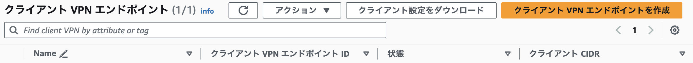
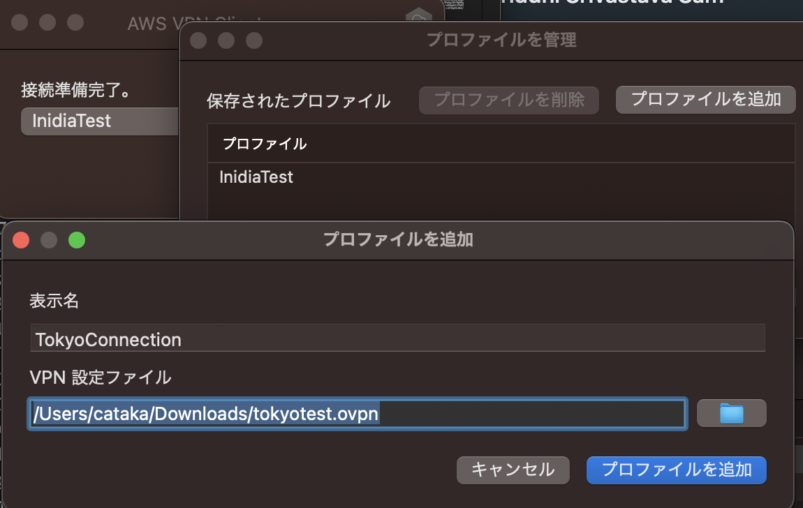
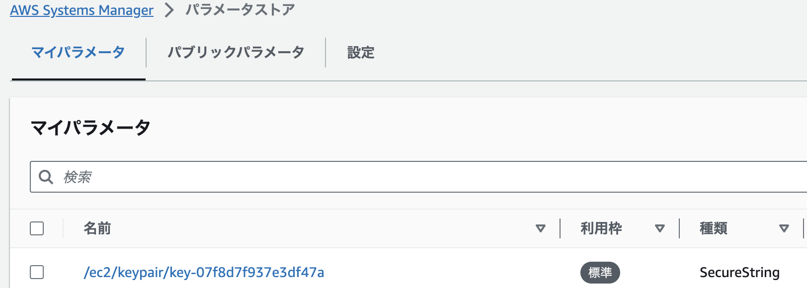
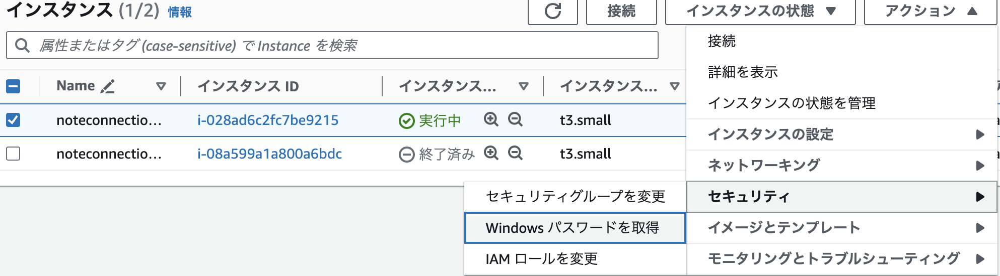
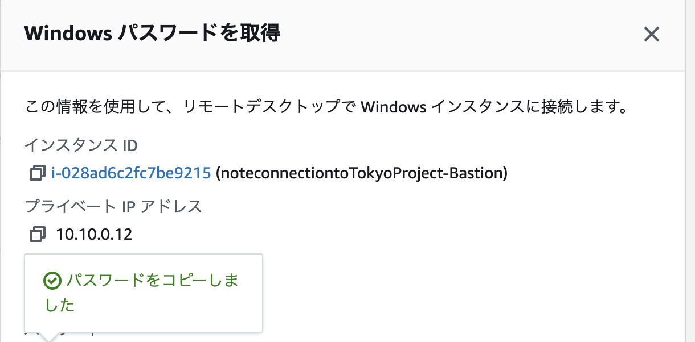

## How to Use this?

**1. Set up the default values in make files**
```
BucketName:=(Your unique S3 bucket)
StackName:=
VPCSetup:=
KeyPair:=
ProjectName:
VPCCidr:=(Private address whatever you want)
#Subnet CIDR must be more than /27
PublicSubnetCidr:=(Cidr within VPC)
Region:=(Where you want connect internationally from the list of aws regions) eg. ap-northeast-1
```
**2. Use commands below**
```
make cert-build
make deploy
```
**3. Check the result in your aws console**

Check the list (Logical ID at the CloudFormation Console):
- VPC
- KeyPair
- EC2
- ClientVPN

just like this message


**4. Download the VPN file from Client VPN Endpoint (VPC) console**

Clicking "クライアント設定をダウンロード"


**5. Edit the file you downloaded (downloaded-client-config.ovpn)**

Add the stuff below:
```
<cert>
Copy from
/vpn-connection/easy-rsa/easyrsa3/pki/issued/client1.domain.tld.crt
</cert>

<key>
Copy from
/vpn-connection/easy-rsa/easyrsa3/pki/private/client1.domain.tld.key
</key>
```
**6. Activate the AWS Client VPN software**

Any third Party software works but I tend to use AWS Client like this



**7. Getting the PW from Keypair Keyboard in AWS console**




**8. Connect to the sever(EC2) you created in the different region**

Use the private IP address that is assigned by AWS and check it in the EC2 Console

**8. Delete the Stack in AWS**

Be careful! If you don't do this, AWS charges you for the usage of fee.

Execute this command below:
```
make clean
```

## Reference

- Nice Website
https://blog.grasys.io/post/ysato/aws-client-vpn/

